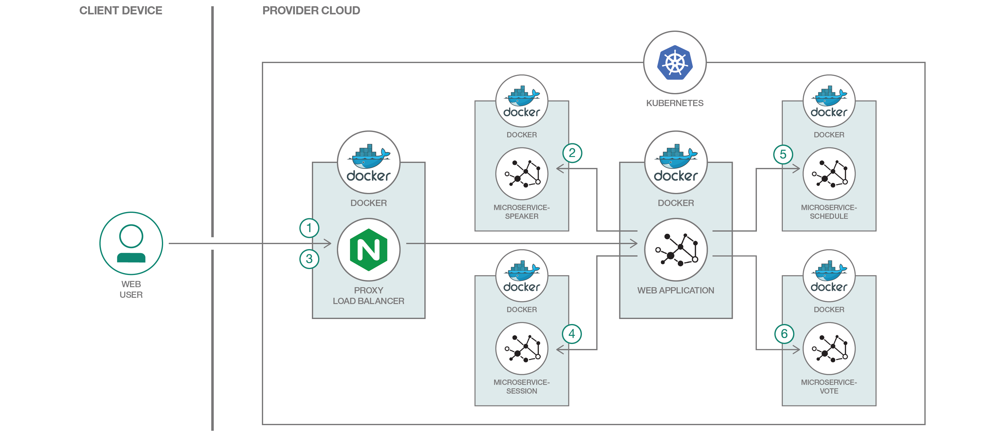
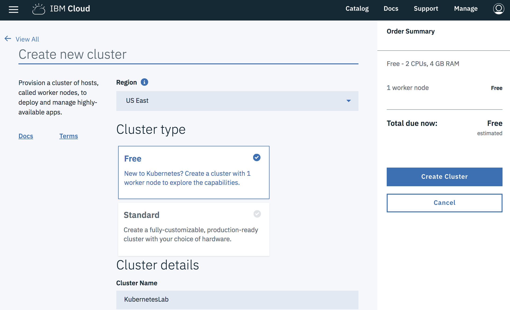
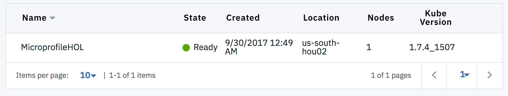
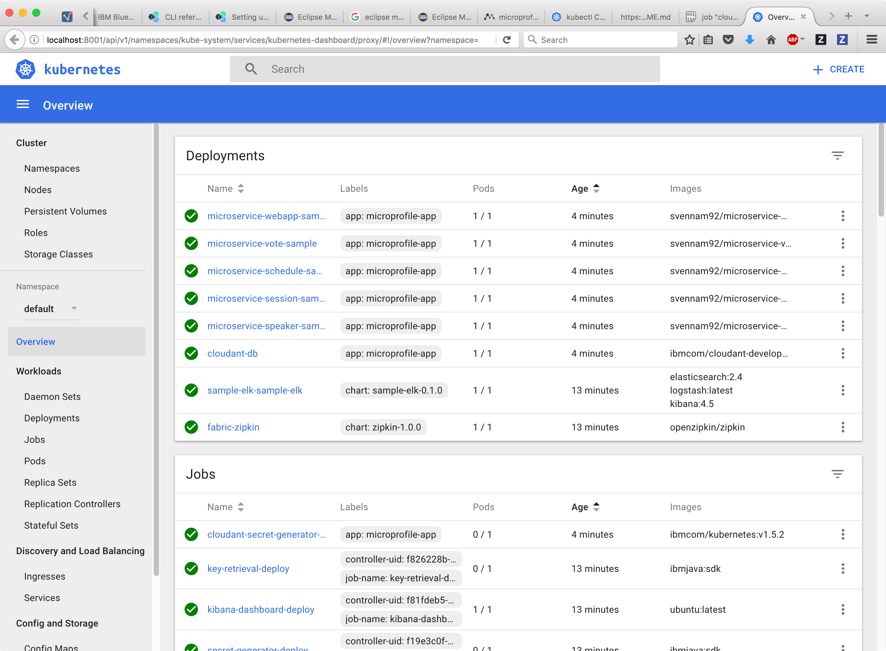
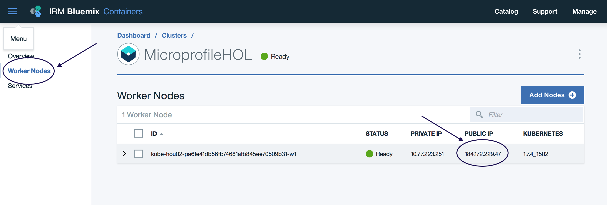
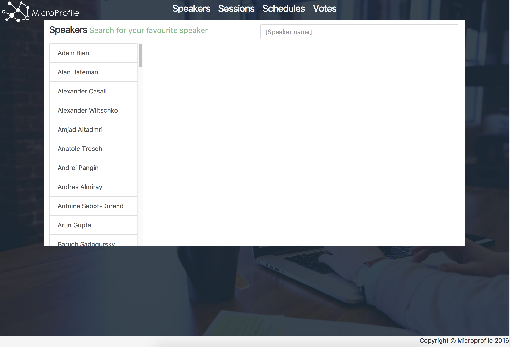
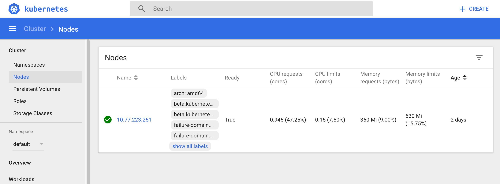
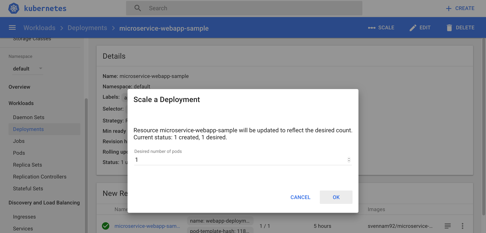
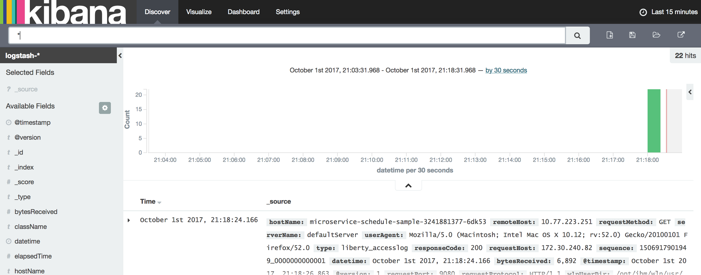

# Create and Deploy Java Microservices with Kubernetes

# Overview

In this hands-on lab, you will learn how to deploy Java microservices based on [MicroProfile](http://microprofile.io) to a Kubernetes cluster. Although we'll be using the Container Service on IBM Cloud to spawn a Kuberentes cluster, you can use any other cloud service or a locally running cluster through MiniKube.

## Application Architecture

In this lab, you'll work with a microservices-based conference application which tracks the sessions, schedules, speakers and votes for a fictitious event. It's made up a of a number of back-end microservices as well as a front-end web application. It's fronted by a NGINX load balancer.



## Prerequisites

### Sign up for an IBM Cloud Account

Sign up for a new account on the [IBM Cloud page](https://console.ng.bluemix.net/).

### Spin up a new Kubernetes Cluster

Access the IBM Cloud Containers dashboard at [https://console.bluemix.net/containers-kubernetes/home/clusters](https://console.bluemix.net/containers-kubernetes/home/clusters)

Click the Create Cluster button, choose the "Free" cluster option and give it a name like "KubernetesLab". It should take 10-20 minutes for a new Kubernetes cluster to get spun-up. You can continue for now and we'll verify that it has started in the first step.



### Install the IBM Cloud CLI

Install by IBM Cloud (Bluemix) CLI - Find the appropriate installer and follow the instructions [here](https://console.bluemix.net/docs/cli/index.html#downloads).

***
> TODO FIX INSTRUCTION FOR INDIA LAB

Login to the CLI with `bx login`. When prompted, use API endpoint `api.ng.bluemix.net`
***

You'll need to install a couple of plugins for the IBM Cloud CLI as well:

```
bx plugin install dev -r Bluemix
```

```
bx plugin install container-service -r Bluemix
# Initialize and verify plugin install
bx cs init
```

### Clone the Lab Repository

Let's clone the materials for the lab. First, `cd` to a working directory of your choice. Then jump to a terminal and type in:
```
git clone https://github.com/svennam92/microprofile-hol.git
cd microprofile-hol
```

If this command didn't work, you need to install Git from [here](https://git-scm.com/downloads).

### Install Other Dependencies

Install the following tools and dependencies:
* [Docker CE](https://www.docker.com/community-edition)
  * Remember to launch Docker after installing.
* [kubectl](https://kubernetes.io/docs/tasks/tools/install-kubectl/)
* [helm](https://github.com/kubernetes/helm)
  * Need to add this to your PATH.

Verify that you've installed them properly by opening a new terminal and running the following commands. Make sure your versions are either newer or matches the ones below.

```
$ docker -v
Docker version 17.09.0-ce, build afdb6d4

# Note this command will fail when checking the server version - it's expected as your CLI is not configured to connect to a server yet.
$ kubectl version
Client Version: version.Info{Major:"1", Minor:"5", GitVersion:"v1.5.6", GitCommit:"114f8911f9597be669a747ab72787e0bd74c9359", GitTreeState:"clean", BuildDate:"2017-03-28T13:54:20Z", GoVersion:"go1.7.4", Compiler:"gc", Platform:"linux/amd64"}
The connection to the server localhost:8080 was refused - did you specify the right host or port?

# Note this command will fail when trying to connect to Tiller, we'll configure this later
$ helm version
Client: &version.Version{SemVer:"v2.6.1", GitCommit:"bbc1f71dc03afc5f00c6ac84b9308f8ecb4f39ac", GitTreeState:"clean"}
Error: cannot connect to Tiller
```

# Step 1: Use Helm to Deploy Curated Dependencies

## Prerequisites

Ensure that your cluster has finished deploying. Navigate to your [dashboard on IBM Cloud](https://console.bluemix.net/containers-kubernetes/home/clusters) and double check that there is a green "Ready" icon.



If it's still not ready, you'll need to wait before proceeding. In the meantime, you can follow the optional step to [build the microservices used in this lab](README-buildAndDeploy.md). To learn more about this project which is based on Java MicroProfile, check out the resources on [microprofile.io](https://microprofile.io/project/eclipse/microprofile-conference).

### Configure CLI to connect to your Kubernetes Cluster

> TODO: FIX API ENDPOINT for India Lab

You should have already installed the IBM Cloud CLI as explained in the previous steps. If you haven't already, make sure you're logged in: `bx login`. If prompted, use API endpoint `api.ng.bluemix.net`.

Run `bx cs init` to initialize your container-service plugin.

Run `bx cs clusters` to see all your clusters in IBM Cloud - there should only be one.

Run `bx cs cluster-config <cluster_name>` to download the configuration file that allows you to access the cluster. It tells you to run a `export` command. Copy-paste to execute that command.

Run `kubectl cluster-info` to ensure that you're connected to the running Kubernetes Cluster. You should see something like this:

```
$ kubectl cluster-info
Kubernetes master is running at https://184.173.44.62:27192
Heapster is running at https://184.173.44.62:27192/api/v1/proxy/namespaces/kube-system/services/heapster
KubeDNS is running at https://184.173.44.62:27192/api/v1/proxy/namespaces/kube-system/services/kube-dns
kubernetes-dashboard is running at https://184.173.44.62:27192/api/v1/proxy/namespaces/kube-system/services/kubernetes-dashboard

To further debug and diagnose cluster problems, use 'kubectl cluster-info dump'.
```

## Helm - Streamline Kubernetes installations

Helm is a tool that allows you to manage Kubernetes "charts". Charts are pre-configured Kubernetes resources.

Later on, you'll deploy your microservices as Docker images from DockerHub to your cluster. However, the microservices need a set of dependencies to work properly - we can deploy these dependencies using Helm.

You'll deploy a fabric layer provided by Microservice Builder, an IBM tool to streamline development. This fabric allows you to connect up Liberty Microprofile instances with other services. The MicroProfile fabric layer greatly sped up development of this application and is required for execution of the app itself. In addition, you'll also deploy a sample ELK stack which allows you to retrieve metrics for the application in a Kibana dashboard.

### Installing prerequisites to our cluster

Initialize the helm installation

```
helm init
```

Install the fabric

```
helm repo add mb http://public.dhe.ibm.com/ibmdl/export/pub/software/websphere/wasdev/microservicebuilder/helm/
helm install --name fabric mb/fabric
```

Install the ELK stack

```
helm repo add mb-sample https://wasdev.github.io/sample.microservicebuilder.helm.elk/charts
helm install --name sample-elk mb-sample/sample-elk
```

### Verify installation

Run `kubectl get pods --show-all`

You should see the following pods getting installed:
```
$ kubectl get pods --show-all
NAME                                     READY     STATUS              RESTARTS   AGE
fabric-zipkin-992988055-88jls            1/1       Running             0          27s
key-retrieval-deploy-fn832               0/1       ContainerCreating   0          16s
kibana-dashboard-deploy-hbn7x            0/1       ContainerCreating   0          16s
sample-elk-sample-elk-2521815307-mscw4   0/3       ContainerCreating   0          16s
secret-generator-deploy-znv3c            0/1       ContainerCreating   0          27s
```

## Next steps

This lab is focused on the deployment of microservices to a Kubernetes cluster. However, it's also important to understand the development flow for creating Docker containers that can be deployed to Kubernetes. To learn how to build your microservices and deploy your containers to DockerHub, skip to the optional steps [Building and Developing your Microservices](README-buildAndDeploy.md). Note that this may take some time depending on your internet connection.

To continue with deploying prebuilt microservices already on DockerHub, proceed to the next step.

# Step 2: Deploy your microservices to your Kubernetes cluster

In this exercise, you'll see why Kubernetes deployments are quick to configure. So far you've created a cluster and deployed the prerequisite dependencies to the cluster using Helm charts. Now you'll push your microservices to your cluster.

## Double check prerequisites

Before you start deploying your application, make sure the Microservice Builder Add-ons are installed and running. In addition, make sure that the `key-retreival-deploy` and `secret-generator-deploy` jobs have completed. Verify this by running the `kubectl get pods --show-all` command and ensuring it looks like the output below.

```
$ kubectl get pods --show-all
NAME                                    READY     STATUS      RESTARTS   AGE
fabric-zipkin-4284087195-d6s1t          1/1       Running     0          11m
key-retrieval-deploy-gkr9n              0/1       Completed   0          11m  # Make sure this job is completed
kibana-dashboard-deploy-rd0q5           1/1       Running     0          11m 
sample-elk-sample-elk-461262821-rp1rl   3/3       Running     0          11m 
secret-generator-deploy-bj1jj           0/1       Completed   0          11m  # Make sure this job is completed
```

## Deploy microservices using manifests

You're ready to deploy the microservices now. Deployments to kubernetes are managed with manifest files - one of the most important things defined in the manifest file is the Docker image itself. Once you deploy a manifest, the cluster will pull the image you've defined in the manifest and follow the other instructions (also in the manifest) to deploy it. The images are already pushed to DockerHub so we simply need to tell our cluster where to pull it from.

First, we need to configure the NGINX gateway IP address to refer to your cluster's external IP. This allows NGINX to properly forward your requests. Follow the instructions below to set the value of the SOURCE_IP env variable present in the `manifests/deploy-nginx.yaml` file with the IP of the node. 

If you aren't already in the root of this git repository, `cd` back to the top-level directory. 

Get the IP of the node

```
$ kubectl get nodes
NAME             STATUS    AGE
10.76.193.96     Ready     23h
```

In my case it looks like this:

```
  env:
    - name: SOURCE_IP
      #change the value of IP with Kubernetes EXTERNAL-IP
      value: xxx.xxx.xx.xxx
```
to
```
  env:
    - name: SOURCE_IP
      #change the value of IP with Kubernetes EXTERNAL-IP
      value: 10.76.193.96
```

Next, we're ready to deploy the microservices and NGINX gateway. Run the command `kubectl create -f manifests`. This will deploy all the manifest files in the `manifests` directory. You should promptly see the following:

```
$ kubectl create -f manifests
job "cloudant-secret-generator-deploy" created
persistentvolume "cloudant-pv" created
persistentvolumeclaim "cloudant-pv-claim" created
service "cloudant-service" created
deployment "cloudant-db" created
replicationcontroller "nginx-rc" created
service "nginx-svc" created
deployment "microservice-schedule-sample" created
service "schedule-service" created
deployment "microservice-session-sample" created
service "session-service" created
deployment "microservice-speaker-sample" created
service "speaker-service" created
deployment "microservice-vote-sample" created
service "vote-service" created
deployment "microservice-webapp-sample" created
service "webapp-service" created
```

After you have created all the services and deployments, you'll have to wait for 5 to 10 minutes. However, you can check the status of your deployment on Kubernetes UI. Run `kubectl proxy` and go to URL 'http://127.0.0.1:8001/ui' to check when the application containers are ready. If it asks you to login, you'll need to enter the token provided in the `cluster-config`.

There's a few ways to get that cluster-config, but here's one way. Let's retreive the token from the existing cluster-config file:
```
# Print location of cluster-config on machine
$ echo $KUBECONFIG
  /Users/svennam/.bluemix/plugins/container-service/clusters/my-cluster-sg-1-admin/kube-config-hou02-my-cluster-sg-1.yml

# Print out the file. You can also open it with an editor.
$ cat /Users/svennam/.bluemix/plugins/container-service/clusters/my-cluster-sg-1-admin/kube-config-hou02-my-cluster-sg-1.yml
  ...
  users:
  - name: XXXX
    user:
      auth-provider:
        name: oidc
        config:
          ...
          id-token: <COPY_THIS>
          ...

Take id-token value and paste it into your browser with the `Token` option selected to login to the dashboard
```

It'll look like this once it's ready:



## Access your Application

Use the public IP of your Kubernetes cluster to access the Web Services Conference Application. You can find the Public IP of your cluster on the [IBM Cloud Containers Dashboard](https://console.bluemix.net/containers-kubernetes/home/clusters). Click your cluster, then click "Worker Nodes" along the leftside. The Public IP is listed by the worker node.



To access your application, navigate to `<PUBLIC_IP>:30056`. Spend a moment to click around and orient yourself with the application.



## Next Steps

Now that you've deployed the microservices, switch hats to a typical Operations engineer who would manage these deployments.

# Step 3: Managing your Kubernetes Cluster

## Kubernetes Dashboard

Let's walkthrough the Kubernetes cluster dashboard. In the previous exercise, you ran `kubectl proxy` to expose access to the Kubernetes cluster dashboard at `localhost:8001/ui`. Access that now.

### Nodes

By clicking on the `Nodes` tab along the left, you'll see each of the worker machines (VMs) that are in your cluster. Since we used a "Lite" Kubernetes deployment, there's a single machine assigned to your cluster. Most of the time, you'll never actually have to work with your physical nodes. Kubernetes manages them for you. However, it's useful to click into your nodes to see how much of the CPU and memory is being allocated.



### Workloads

The `Workloads` section allows you to directly manage orchestration of your microservices. This ranges from inspecting the `pods` that represent each instance of your microservices to deployments and replica sets responsible for actually spinning those `pods` up.

In the `Pods` section, you'll see the list of pods that are in your cluster. A Pod is the smallest deployment unit that Kubernetes allows your to manage - it's usually made up of one but can be more containers. These containers share storage and network within the pod. The best practice is to have each pod encompass a single capability or feature. In our case, each microservice is a pod of its own. You can also inspect the logs on each pod by hitting the `Logs` icon on each Pod.

In the `Deployments` section, you'll see a list of all the deployments that Kubernetes is managing for you. A deployment tells Kubernetes how many replicas of each pod you need (horizontal scaling), where to actually fetch the images (registry) that make up your pod and even lets you scale the pods directly through the UI.



### Discovery and Load Balancing

The `Discovery and Load Balancing` section is crucial to microservice development. `Services` simplify how your containers find and talk to each other. As just mentioned, Kubernetes will handle scaling your pods horizontally. However, you have to consider that now each pod has a different IP address. With Pods being ephemeral, it's not reasonable to manage all of these IPs. Because of this, a load balancer is automatically setup to route requests to each of these scaled pods. This is one of the biggest advantages in Kubernetes. Access to each of your microservices is simplified to the "name" of the service you setup for it. This means your application code doesn't need to know the IP or URL of each of microservice in your cluster - it simply needs the service name. The microservices can access each other using the service name, which can be as simple as "schedule" or "session".

The `Ingresses` section is used for a number of things, but primarily used for creating an externally-accessible URL for your cluster. Your front-end web application has an Ingress so you can access it from the public web.

### Config and Storage

The `Config and Storage` section allows you to manage sets of config that your microservices use, manage persistent volumes as well as secrets.

You can edit the configuration live in your cluster in the `Config Maps` view. This means you don't need to redeploy your apps to use the latest configuration values.

The `Secrets` tab allows you to manage things like SSH keys, API Keys, tokens and more. They are accessible in a secure way from the containers that are running in your cluster.

## Kibana Dashboard

Access your Kibana dashboard for metrics, logs and analytics visualizations. You can access it at `http://[Public IP]:30500`. The Public IP is the same one you identified in Exercise 4. This dashboard is made available through the Microservice Builder Add-ons we installed via Helm.

It may request that you set up an index pattern. Use the "datetime" index pattern.

The `Discover` tab allows you to see log messages.



The `Dashboard` tab allows you to create a dashboard of data visualizations. Go here now, hit the "+" button on the top right, and start adding some of the visualizations and customizing your dashboard. Some of the interesting default visualizations are `messageGraph` and `accessLogPie`. You can create new visualizations in the `Visualize` tab.

# Next Steps and More Resources

At this point, you can skip back to the optional step to [build and deploy](README-buildAndDeploy.md) your Java microservices from your local machine.

To learn more about the microservices that we deployed and how they utilize the Java Microprofile technology, see the [GitHub project](https://github.com/eclipse/microprofile-conference). There are extensive instructions on how to actually develop these microservices.

On the IBM Developer Works website, see the [full journey](https://developer.ibm.com/code/journey/deploy-microprofile-java-microservices-on-kubernetes/) that explains the steps we followed, architecture diagrams, blogs, utilized technologies and more.

Get started with running a Kubernetes cluster on your local machine for development with [Minikube](https://kubernetes.io/docs/getting-started-guides/minikube/).
Manage your Kubernetes cluster on [IBM Cloud](https://console.bluemix.net/containers-kubernetes/home/clusters).
